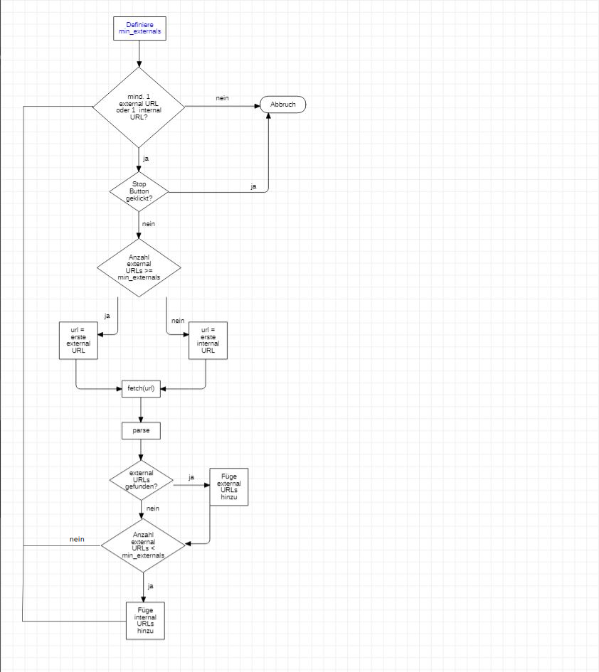

# Recherche

## DNT Header

- DNT Header ist deprecated (https://developer.mozilla.org/en-US/docs/Web/HTTP/Headers/DNT)
- DNT Header kann über JavaScript ausgelesen werden (Navigator.doNotTrack https://developer.mozilla.org/en-US/docs/Web/API/Navigator/doNotTrack)
    - DNT Header kann 3 Werte haben:
        - 0: Tracking ist erlaubt
        - 1: Tracking ist nicht erlaubt
        - null: Keine spezifische Präferenz
- Wird dem Request Header mitgegeben
- Unterstützt von folgenden Browser (https://www.geeksforgeeks.org/http-headers-dnt/): Google Chrome, Internet Explorer, Microsoft Edge, Firefox, Opera

## User Agent & Custom Request

Aktuell wird über ```https.get``` die Seite abgeholt in der ```fetch()``` Methode

- Verwenden von ```https.request``` (https://nodejs.org/api/https.html#https_https_request_url_options_callback)
    - Es können dort zusäätzliche Optionen mitgegeben werden, unter Anderem auch für den Header (https://nodejs.dev/learn/making-http-requests-with-nodejs)
    
    ```javascript
        const https = require('https');

        const options = {
            hostname: 'encrypted.google.com',
            port: 443,
            path: '/',
            method: 'GET',
            headers: {
                'DNT': 1
            }
        };

        const req = https.request(options, (res) => {
            console.log('statusCode:', res.statusCode);
            console.log('headers:', res.headers);

            res.on('data', (d) => {
                process.stdout.write(d);
            });
        });

        req.on('error', (e) => {
            console.error(e);
        });
        req.end();
    ```
- DNT kann so gesetzt werden oder auch nicht
## Crawler Flowchart
- Auf Fehlerbehandlung von `fetch()` und `parse()` verzichtet
- Wurde bereits umgesetzt

